# Yummy Recipes

Yummy Recipes is recipe web management app which allows users to search for recipes using a query string that can be a recipe name like (“Pasta”) or an ingredient name that they have in their pantry/refrigerator ("Tomatoes, Onions") or any kitchen appliance name like (‘airfryer’,  ‘oven’,..). Not only you can search but also it allows users to create their own recipes and store so that it can be populated when other users search for similar recipes.

## Table of Contents

- Tech Stack
- Features
- Installation
- Future State

## Tech Stack

- Python
- Flask
- PostgreSQL
- SQLAlchemy
- JavaScript
- JQuery
- Jinja
- HTML
- CSS
- Bootstrap

## Dependencies
Can be found in requirements.txt .


## Features
## Landing Page

Once you open the app you can see the homepage. On the homepage you can see the nav bar to navigate to different pages. This nav bar is  present on every page. On the homepage you can even see two random recipes and food trivia displayed on the carousel.

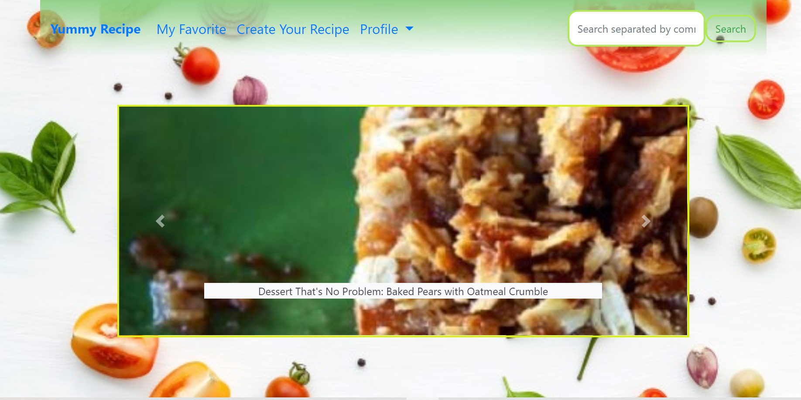

 ## Search
  
  User can search using recipe using the recipe name like "sushi" in the search button.

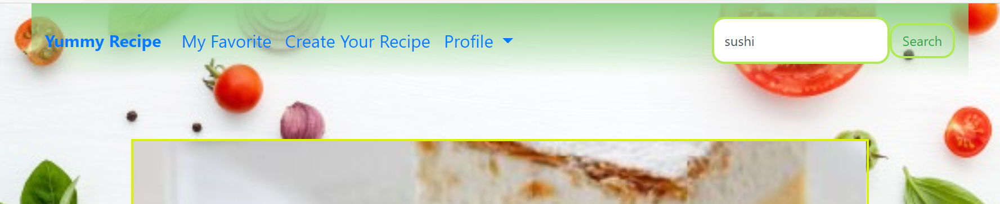

  User can search using recipe using the ingredient name like "tomatos, onion, garlic" in the search button.

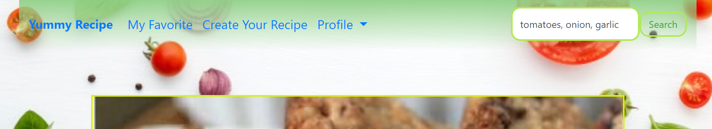

  User can view the search result.

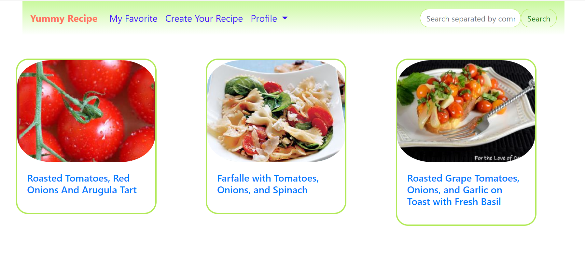

## Search Result

User can search even in the search result page using any of the above mentioned ways or using the kitchen appliance name that they want to use to make a any recipe like "Airfryer" in the search button.


Search result for appliance name Airfryer.

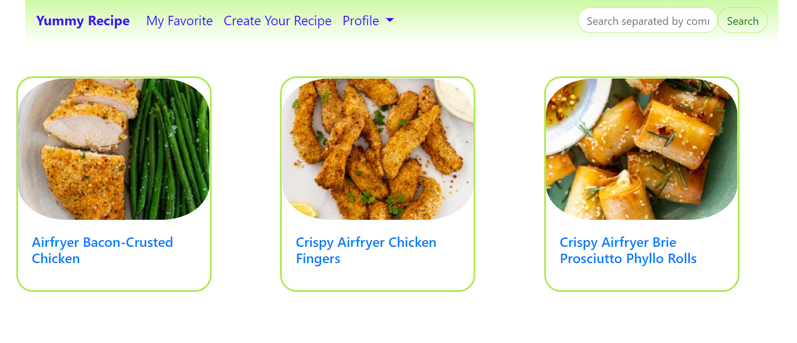


## Recipe Details

Once user clicks on one of the recipe to view the details it directs to the next page where user can see the details of the recipe - title, instructions, ingredient images, nutri info.

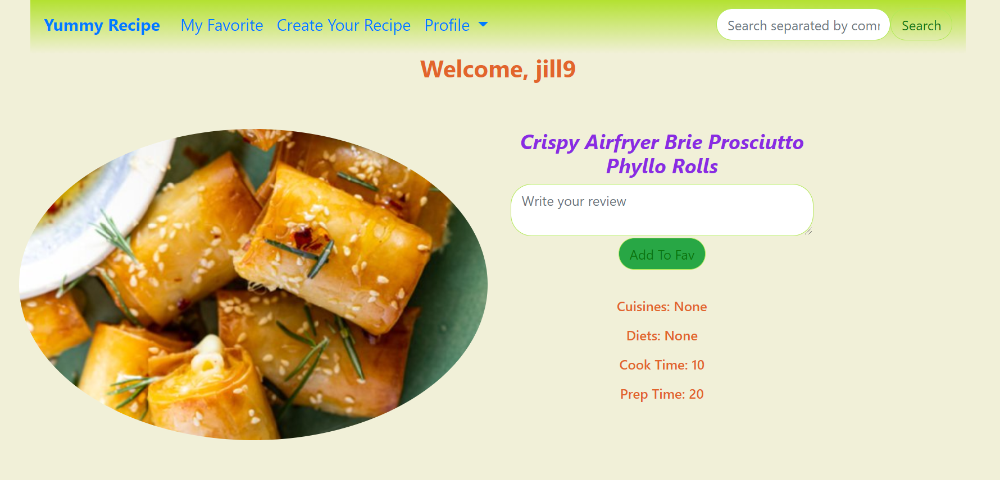

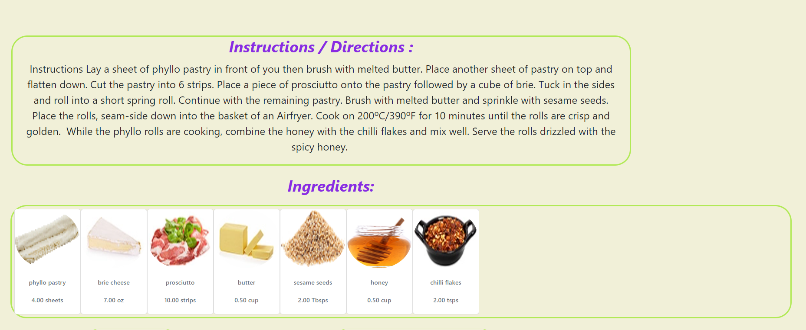

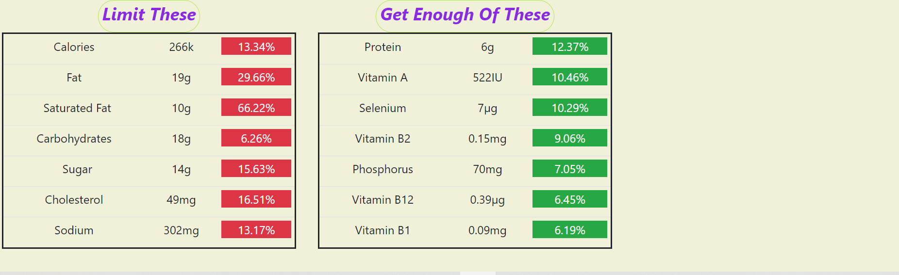

User can write a review  or add a recipe to his favorites by clicking on the "add to favorite" button and if user is logged in then he can see this message which says "added to favorite".

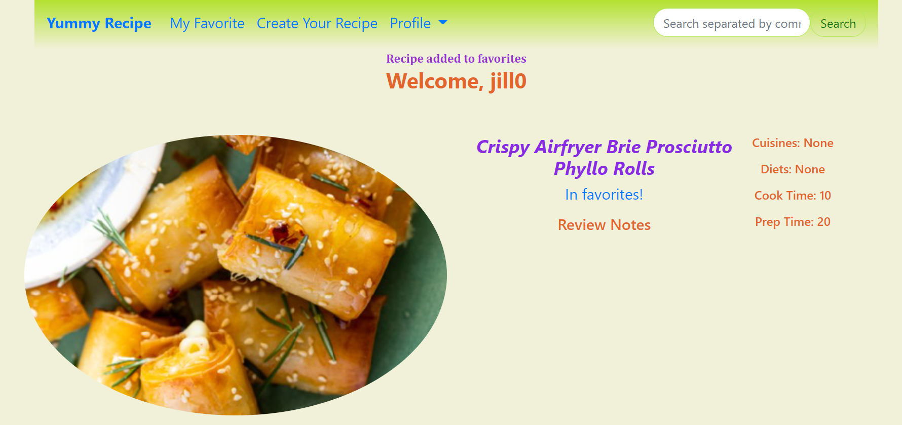

## Login

If user is not logged in then it directs you to the login page.

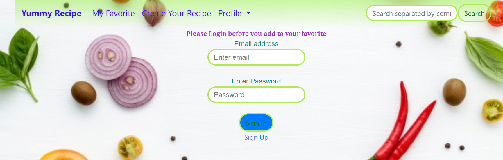

If user did not create an account it directs to signup page.

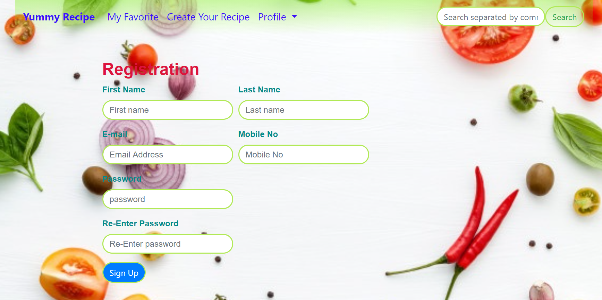

Once he logs in he is directed back to the recipe details page to add to his favorite.

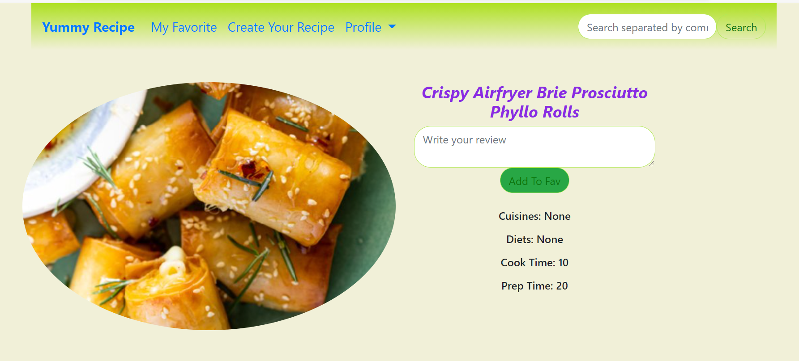

## Create Recipe

User can create his own recipe and store in the database.User should add the title, description, instruction and ingredients. User should add each ingredient at a time into the table. And if they want to delete an ingredient from the table they can.

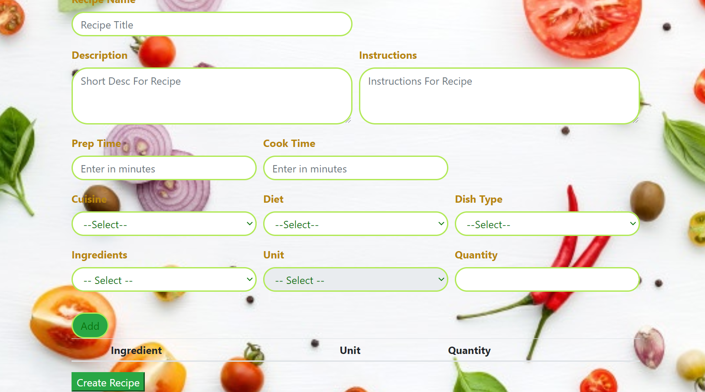

  
## API Reference

- Spoonacular / RapidAPI

## Installation 

To run Yummy Recipes on your own machine to find easy and tasty recipes

- Install PostgresQL (Mac OSX)

- Clone or fork this repo:

```bash 
  https://github.com/ksusmi/hbproject.git
  cd my-project
```
- Create and activate a virtual environment inside your hbproject directory:

```bash
virtualenv env
source env/bin/activate
```

- Install the dependencies:

```bash
pip install -r requirements.txt
```

- Sign up to use the Rapid API / Spoonacular or you can use the recipes stored in the database.

- If you plan to use the API then save your API keys in a file called secrets.sh using this format:

```bash
export RAPID_API_KEY="YOUR_KEY_HERE"
```

- Source your keys from your secrets.sh file into your virtual environment:

```bash
source secrets.sh
```

- Set up database:

```bash 
createdb entries
python3 model.py
```

- Run the app:

```bash
python3.6 server.py
```

- Navigate to 'localhost:5000/' to access hbproject and start using!

## Future State

In the future version of this app, planning to implement the following features:

-  Advanced search option
-  Add ingredient shopping list for recipe.
-  Social login for user registration


  
